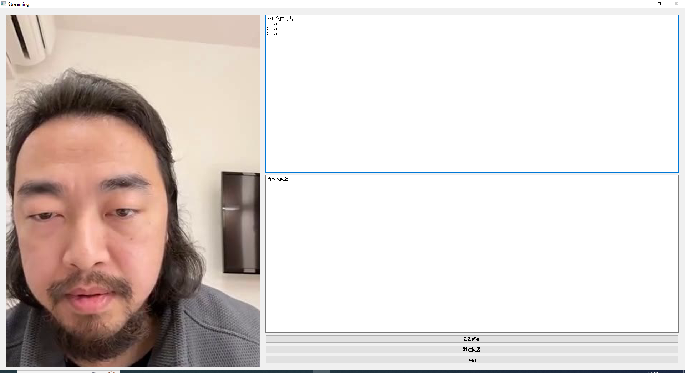

# 如何本地使用

本文将介绍如何在本地使用AiStreamer。

## 项目内容

AiStreamer提供了一套完整的框架，它能够实现对你喜欢的主播的快速克隆，并且设定AI主播们的个性，让他们制造节目效果等等。它为你提供了一个创造性的平台，让你可以用AI技术制作出有趣的内容。如果你想使用AiStreamer来打造自己的节目，本文将介绍如何在本地使用AiStreamer。请注意请不要使用本项目用于用于虚假新闻、网络欺诈、网络钓鱼等不良行为，此外，数字人克隆技术也可能被用于人身攻击、隐私侵犯等不良行为。

## 先决条件

在开始使用AiStreamer之前，您需要安装相应的库，请执行以下命令：

```
git clone https://github.com/Jarvis-zou/AiStreamer.git
pip install -r requirements.txt
sudo apt-get install ffmpeg
```

## 获取权重以及测试用例

你也可以在[这里](https://drive.google.com/file/d/18brA0qfVQ5fE0MHsGq9thxZW-oWpPfjd/view?usp=share_link)下载所有的数据，文件中包含了所有所需的模型和初次运行所需的用例。

解压后文件目录为：

```
source/
├── ckpt/
│   ├── fengge/
│   │   ├── default.yaml
│   │   └── ...
│   └── pwgan_aishell3_static_1.1.0/
│   │   ├── pwgan_aishell3.pdiparams
│   │   ├── pwgan_aishell3.pdiparams.info
│   │   └── pwgan_aishell3.pdmodel
├── checkpoints/
│   ├── s3fd.pth
│   └── wav2lip_gan.pth
├── fengge/
│   ├── not_talking_source/
│   │   ├── not_talking_1.avi
│   │   └── ...
│   ├── sync_result/
│   │   └── ...
│   ├── talking_source/
│   │   ├── talking_1.avi
│   │   └── ...
```

其中需要将`s3fd.pth`放入`src/Wav2Lip/face_detection/detection/sfd`目录下

## 运行

要运行程序，需要先将openai api key设置为环境变量，然后请执行以下命令：

```
python start_stream.py --room_id <live room id> --encoder <source/ckpt/fengge> --vocoder <source/ckpt/pwgan_aishell3_static_1.1.0> --wav2lip_model <source/checkpoints/wav2lip_gan.pth> --video_source <source/>
```

这将启动程序，您将会看到一个QT界面，您可以在其中询问你的问题。



# 如何使用app

在右上角可以看到当前已经生成结束的回答编号，操作步骤为下：

- 点击`看看问题`，将会在右下的文本框内显示当前文件列表置顶回答所对应的原弹幕提问。
- 如果已经点击`看看问题`且该问题你觉得不合适则可以点击`跳过问题` ，该操作将删除当前文件列表第一个文件(也就是当前的问题)，此时再点击`看看问题`将查看下一个问题。
- 点击`播放`，将播放当前置顶的回答，注意：播放前必须点击看看问题，否则视频将不会载入。
- 播放完毕点击跳过问题，将删除当前已经播放完毕的回答，此时置顶为下一条回答。

## 反馈

如果您在使用AiStreamer时遇到任何问题，请随时联系我们，我们将竭诚为您服务。